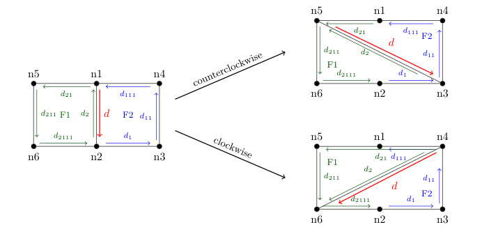
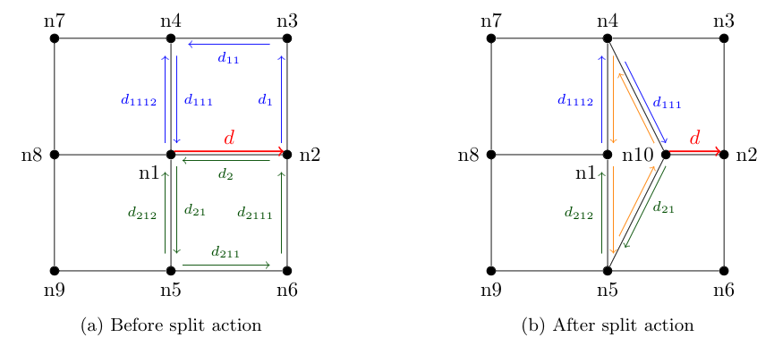
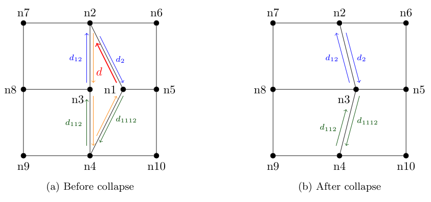

# Quadrangular Actions

## Flip 

The **flip** action can be decomposed as follows:

* Check whether the dart `d` exists.  
* Update the **beta1** relations.  
* Update the links from nodes `n1` and `n2`,  if they were previously linked to the flipped dart.  
* Update the links from faces `F1` and `F2`, if they were previously linked to the flipped dart.  
* Update the node links for `d` and `d2`.  
* Update the face links depending on the orientation (darts which change of face):
  * If **counterclockwise**: update links for `d1` and `d21`.  
  * If **clockwise**: update links for `d2111` and `d111`.  
* Update the scores of the nodes.

## Split 

The **split** action can be decomposed as follows:

* Check whether the dart `d` exists.  
* Create a new node **n10** in the middle of [n1,n2]
* Update node links of `d` and `d21`, they are now linked to `n10`
* Create a new face with yellow darts
* Update the **beta2** relations (`d1112`, `d111`,`d212`, `d21`).
* Update the scores of the nodes.

## Collapse 

The **collapse** action can be decomposed as follows:

* Check whether the dart `d` exists.  
* Save the score of node `n1` for later computation.  
* If `n3` is not on the boundary, move its coordinates to the midpoint between `n3` and `n1`.  
* Check if nodes `n2` and `n4` are linked to the dart being deleted. If so, reassign their links to existing darts (node `n3` will be checked later).  
* Delete the face associated with `d`, along with its related darts.  
* Reassign all darts previously linked to `n1` so they now point to `n3`.  
* Link the dart associated with `n3` to an existing node.  
* Update the **beta2** relations (`d2`/`d12`, `d112`/`d1112`).  
* Recalculate the scores of the affected nodes.
